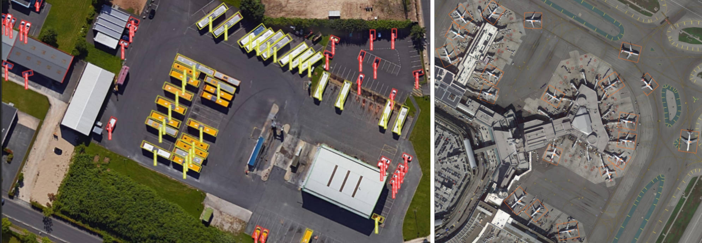
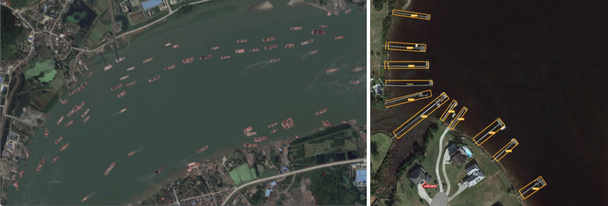
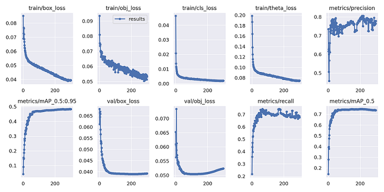

# Yolov5 for Oriented Object Detection




The code for the implementation of “[Yolov5](https://github.com/ultralytics/yolov5) + [Gray Code Label](https://arxiv.org/abs/2003.05597v2)”. 

# Results and Models
The results on **DOTA_subsize1024_gap200_rate1.0** test-dev set are shown in the table below. 

 | Model<br><sup>(download link)                                                   | Size<br><sup>(pixels) | TTA<br><sup>(multi-scale/<br>rotate testing) | OBB mAP<sup>test<br><sup>0.5<br>DOTAv1.0 | Speed<br><sup>CPU b1<br>(ms) | Speed<br><sup>3090Ti b1<br>(ms) | Speed<br><sup>3090Ti b16<br>(ms) | params<br><sup>(M) |
|---------------------------------------------------------------------------------|-----------------------|----------------------------------------------|------------------------------------------|------------------------------|---------------------------------|----------------------------------|--------------------|
 | yolov5m_csl [[baidu](https://pan.baidu.com/s/1UPNaMuQ_gNce9167FZx8-w?pwd=yolo)] | 1024                  | ×                                            | **78.7**                                 | **328.2**                    | **11.4**                        | **7.0**                          | **21.6**           |
 | yolov5m_gcl [[baidu](https://pan.baidu.com/s/1Lqw42xlSZxZn-2gNniBpmw?pwd=yolo)] | 1024                  | ×                                            | **77.0**                                 | -                            | -                               | **6.4**                          | **21.0**           |


<details>
  <summary>Table Notes (click to expand / **点我看更多**)</summary>

* All checkpoints are trained to 300 epochs with [COCO pre-trained checkpoints](https://github.com/ultralytics/yolov5/releases/tag/v6.0), default settings and hyperparameters.
* **mAP<sup>test dota</sup>** values are for single-model single-scale on [DOTA](https://captain-whu.github.io/DOTA/index.html)(1024,1024,200,1.0) dataset.<br>Reproduce Example:
 ```shell
 python val.py --data 'data/dotav15_poly.yaml' --img 1024 --conf 0.01 --iou 0.4 --task 'test' --batch 16 --save-json --name 'dotav15_test_split'
 python tools/TestJson2VocClassTxt.py --json_path 'runs/val/dotav15_test_split/best_obb_predictions.json' --save_path 'runs/val/dotav15_test_split/obb_predictions_Txt'
 python DOTA_devkit/ResultMerge_multi_process.py --scrpath 'runs/val/dotav15_test_split/obb_predictions_Txt' --dstpath 'runs/val/dotav15_test_split/obb_predictions_Txt_Merged'
 zip the poly format results files and submit it to https://captain-whu.github.io/DOTA/evaluation.html
 ```
* **Speed** averaged over DOTAv1.5 val_split_subsize1024_gap200 images using a 2080Ti gpu. NMS + pre-process times is included.<br>Reproduce by `python val.py --data 'data/dotav15_poly.yaml' --img 1024 --task speed --batch 1`

</details>

# Installation
Please refer to [install.md](./docs/install.md) for installation and dataset preparation.

# Getting Started 
This repo is based on [yolov5](https://github.com/ultralytics/yolov5). 

And this repo has been rebuilt, Please see [GetStart.md](./docs/GetStart.md) for the Oriented Detection latest basic usage.

#  Acknowledgements
I have used utility functions from other wonderful open-source projects. Espeicially thank the authors of:

* [ultralytics/yolov5](https://github.com/ultralytics/yolov5).
* [Thinklab-SJTU/CSL_RetinaNet_Tensorflow](https://github.com/Thinklab-SJTU/CSL_RetinaNet_Tensorflow).
* [jbwang1997/OBBDetection](https://github.com/jbwang1997/OBBDetection)
* [CAPTAIN-WHU/DOTA_devkit](https://github.com/CAPTAIN-WHU/DOTA_devkit)
* [hukaixuan19970627/yolov5_obb](https://github.com/hukaixuan19970627/yolov5_obb)